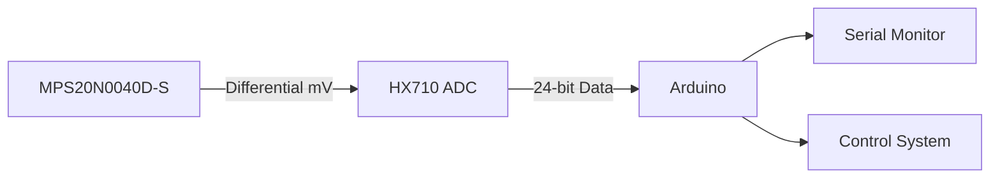
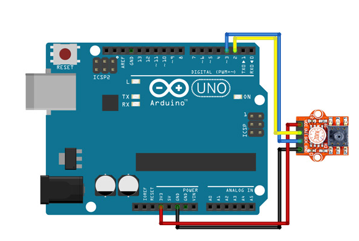

# MPS20N0040D

## Scientific Background
### 1. Pressure Measurement Principle
The sensor uses MEMS piezoresistive technology. The output voltage ($V_{out}$) relates to applied pressure ($P$) by:

$$
V_{out} = V_{bias} + S \cdot P + \epsilon(T)
$$

Where:
- $S$ = Sensitivity (-0.21%FS/°C, datasheet)
- $\epsilon(T)$ = Temperature error (±0.08%FS/°C)

### 2. Venturi Flow Equation
Flow rate ($Q$) is calculated using Bernoulli's principle:

$$
Q = A_1 \sqrt{\frac{2\Delta P}{\rho(1-\beta^4)}}
$$

Where:
- $\beta = \frac{d_2}{d_1}$ (diameter ratio)
- $\rho$ = Fluid density (kg/m³)

---

## System Diagram


## Wiring Diagram


**The following is a description of the image:**
1. The sensor, designated as MPS20N0040D-S, is connected to
   - Pin 1, identified as V+. It is to be connected to **a 5V Microcontroller**
   - Pin 2 (GND) is to be connected to: Connects to **GND Microcontroller**
   - Pin 3 (Vout+): Connects to **IN+ HX710**
   - Pin 4 (Vout-): Connects to **IN- HX710**

---

## Installation
1. Download the ZIP and install via Arduino IDE:  
   **Sketch > Include Library > Add .ZIP Library**
2. Or clone to Arduino libraries folder:
   ```bash
   git clone https://github.com/4211421036/mps20n0040d-sensor.git
   ```

---

## Function Documentation
| Function | Parameters | Description |
|----------|------------|-------------|
| `begin()` | - | Initializes sensor and ADC pins |
| `readPressure()` | - | Returns pressure in **Pascals (Pa)** |
| `calculateFlowRate()` | `pressureDiff`, `density` (optional) | Computes flow rate in **m³/s** |

---

## Example Code
```cpp
#include <MPS20N0040D.h>

// Pin definition
#define PD_SCK 3
#define DOUT 4

MPS20N0040D sensor(PD_SCK, DOUT);

void setup() {
  Serial.begin(9600);
  sensor.begin();
}

void loop() {
  float pressure = sensor.readPressure();
  float flowRate = sensor.calculateFlowRate(pressure, 1000.0); // Water density
  
  Serial.print("Pressure: "); 
  Serial.print(pressure); 
  Serial.println(" Pa");
  
  Serial.print("Flow Rate: "); 
  Serial.print(flowRate * 1000, 2); // Convert to L/s
  Serial.println(" L/s");
  
  delay(1000);
}
```

---

## Calibration Procedure
1. Apply **known pressures** (0-40kPa) using a dead weight tester
2. Record ADC outputs
3. Update these constants in `MPS20N0040D.cpp`:
   ```cpp
   const float V_REF = 5.0;    // Measured reference voltage
   const float FS_OUTPUT = 0.1; // Verified full-scale output
   ```

---

## Technical Specifications
| Parameter | Value | Unit |
|-----------|-------|------|
| Pressure Range | 0-40 | kPa |
| Accuracy | ±0.25 | % FS |
| Operating Voltage | 2.6-5.5 | V |
| Output Data Rate | 10/80 | SPS |

---

## Author
1. Ana Maulida
2. GALIH RIDHO UTOMO

---
